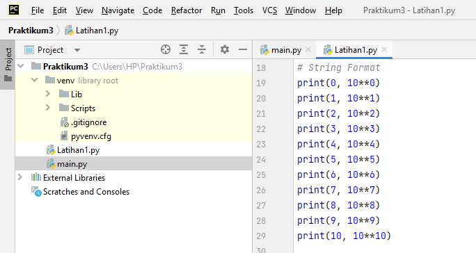
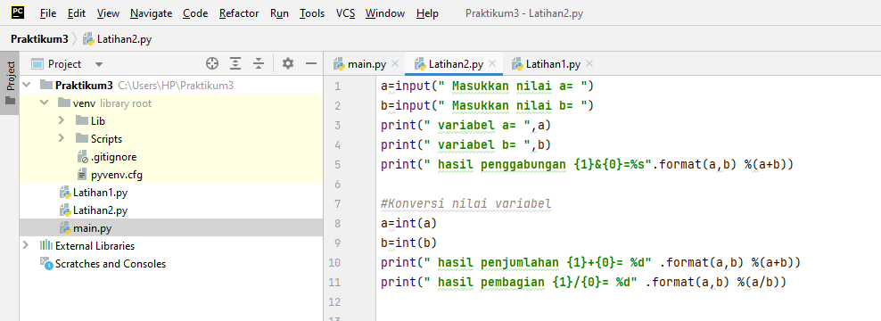
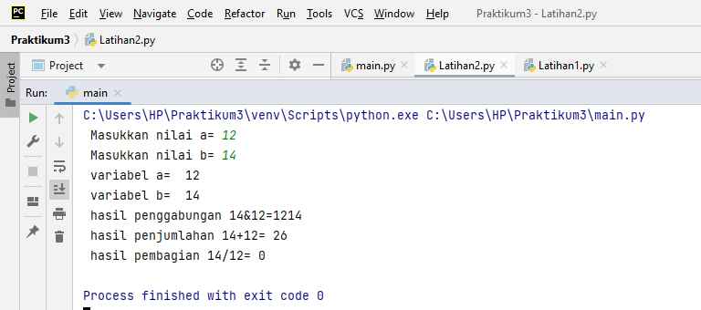

# Praktikum 3
1. Buatlah repository dengan nama Praktikum3

# Membuat Program Python
1. Sebelum membuat program, pastikan pycharm sudah terinstal di komputer.

2. Jika pycharm sudah terinstal, silahkan membuat program untuk menghitung luas dan keliling lingkaran. berikut ini merupakan program nya :

3. Hasil dari program python yang sudah dibuat, antara lain :

4. Flowchart dari program yang sebelumnya sudah dijalankan

# Mengcommit yang sudah dikerjakan ke Github
1. Langkahnya adalah sebagai berikut:

